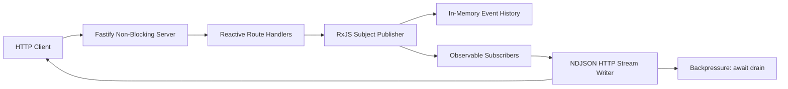

# Reactive Event Backend

Reactive Event Backend is a non-blocking backend prototype built with Fastify and RxJS. It demonstrates a complete Publisher-Subscriber flow where producers publish domain events, subscribers consume event streams, and HTTP endpoints process data through native reactive streams instead of blocking request handlers.

## Project Objective

Construct a responsive and resilient backend using a full reactive programming model, asynchronous event streams, and non-blocking data flow.

## Main Features

- Publisher-Subscriber event bus implemented with RxJS `Subject`.
- Non-blocking HTTP server implemented with Fastify.
- NDJSON streaming endpoints powered by Observables.
- Backpressure handling through Node.js writable stream `drain` events.
- Live event subscriptions with client disconnect cancellation.
- Load simulation with `autocannon`.
- Automated tests using the Node.js test runner.

## Architecture



## API Endpoints

| Method | Endpoint | Description |
| --- | --- | --- |
| `GET` | `/api/health` | Returns service status and reactive runtime metrics. |
| `POST` | `/api/events` | Publishes a new event into the RxJS event bus. |
| `GET` | `/api/events?limit=50` | Streams stored event history as NDJSON. |
| `GET` | `/api/events/live?type=orders.created` | Opens a live subscription to matching events. |
| `GET` | `/api/simulate?count=200&delayMs=0` | Streams generated asynchronous events for performance testing. |
| `GET` | `/api/analytics` | Reduces the event history stream into summary metrics. |

## How to Run

```bash
npm install
npm start
```

The service starts at:

```text
http://localhost:3000
```

## Demo Commands

Seed sample events:

```bash
npm run demo:seed
```

Run a curl demo:

```bash
npm run demo:curl
```

Run the performance simulation:

```bash
npm run demo:load
```

Optional load variables:

```bash
CONNECTIONS=200 DURATION=20 WORKERS=4 npm run demo:load
```

## Test

```bash
npm test
```

## Why This Backend Is Reactive

Each endpoint is implemented around RxJS Observables. Events are published through a `Subject`, transformed through stream operators, and emitted to HTTP clients as asynchronous sequences. Streaming endpoints do not build a full response in memory. They write each emitted item as NDJSON and pause when the HTTP socket reports backpressure.

## Backpressure Strategy

The function `writeObservableAsNdjson` writes each Observable emission to the HTTP response. If `response.write()` returns `false`, the writer awaits the `drain` event before processing more data. This prevents the server from flooding slow clients and proves that the stream respects subscriber capacity.

## Source Code Access

Repository URL:

```text
Replace this line with your GitHub or GitLab URL after pushing the project.
```
